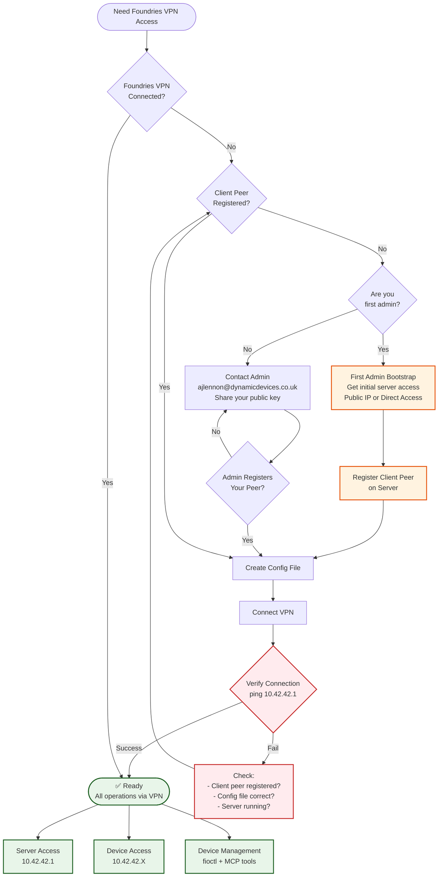
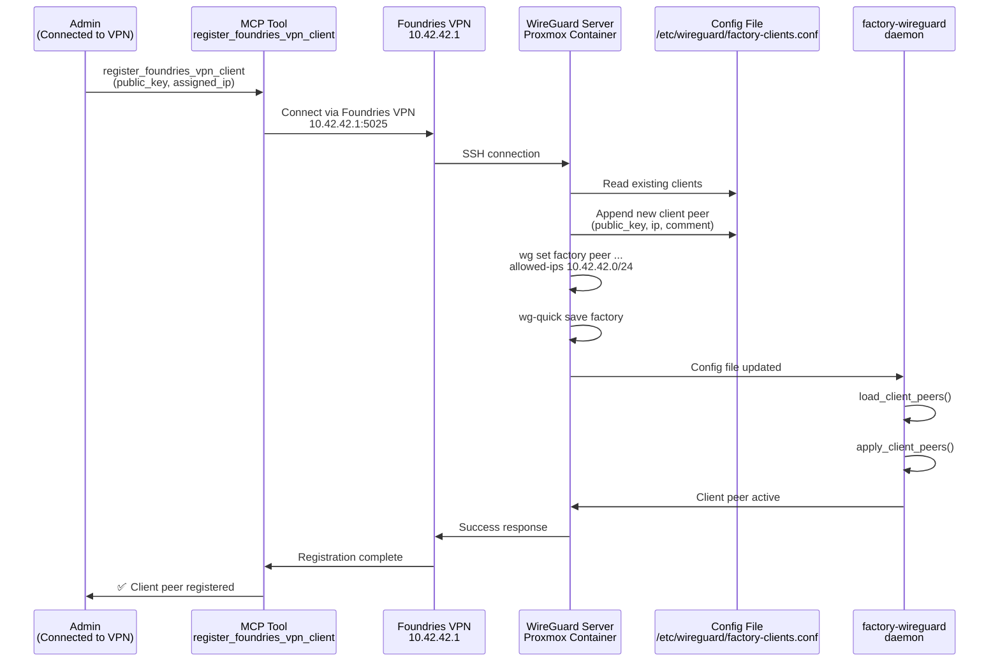

# Foundries VPN Setup Process Diagram

## Complete Setup Flow

```mermaid
flowchart TD
    Start([Start: Foundries VPN Setup]) --> CheckAdmin{Are you the<br/>first admin?}
    
    %% First Admin Bootstrap Path
    CheckAdmin -->|Yes| FirstAdmin[First Admin Bootstrap]
    FirstAdmin --> GetServerAccess[Get Initial Server Access<br/>Public IP or Direct Access<br/>One-time only]
    GetServerAccess --> GenerateKeys1[Generate WireGuard Keys<br/>wg genkey | wg pubkey]
    GenerateKeys1 --> RegisterSelf[Register Client Peer on Server<br/>Add to /etc/wireguard/factory-clients.conf<br/>wg set factory peer ... allowed-ips 10.42.42.0/24]
    RegisterSelf --> CreateConfig1[Create Client Config File<br/>~/.config/wireguard/foundries.conf<br/>Private key + Assigned IP]
    CreateConfig1 --> ConnectVPN1[Connect to Foundries VPN<br/>connect_foundries_vpn]
    ConnectVPN1 --> Verify1[Verify Connection<br/>ping 10.42.42.1<br/>check_client_peer_registered]
    Verify1 --> AdminReady[✅ Admin Ready<br/>Can manage via Foundries VPN]
    
    %% Subsequent Engineer Path
    CheckAdmin -->|No| Engineer[Subsequent Engineer]
    Engineer --> GenerateKeys2[Generate WireGuard Keys<br/>wg genkey | wg pubkey]
    GenerateKeys2 --> ShareKey[Share Public Key with Admin<br/>Email: ajlennon@dynamicdevices.co.uk]
    ShareKey --> AdminRegisters{Admin Registers<br/>via Foundries VPN}
    AdminRegisters -->|Admin uses| RegisterTool[register_foundries_vpn_client<br/>Connects via 10.42.42.1]
    RegisterTool --> AddToConfig[Admin adds to<br/>/etc/wireguard/factory-clients.conf<br/>on server]
    AddToConfig --> CreateConfig2[Create Client Config File<br/>~/.config/wireguard/foundries.conf<br/>Private key + Assigned IP]
    CreateConfig2 --> ConnectVPN2[Connect to Foundries VPN<br/>connect_foundries_vpn]
    ConnectVPN2 --> Verify2[Verify Connection<br/>ping 10.42.42.1<br/>check_client_peer_registered]
    Verify2 --> EngineerReady[✅ Engineer Ready<br/>Can access via Foundries VPN]
    
    %% Ongoing Operations
    AdminReady --> OngoingOps[Ongoing Operations<br/>All via Foundries VPN]
    EngineerReady --> OngoingOps
    
    OngoingOps --> ServerOps[Server Management<br/>ssh root@10.42.42.1 -p 5025<br/>register_foundries_vpn_client<br/>check_client_peer_registered]
    OngoingOps --> DeviceOps[Device Management<br/>list_foundries_devices<br/>enable_foundries_vpn_device<br/>enable_foundries_device_to_device<br/>ssh_to_device via VPN IP]
    OngoingOps --> FioctlOps[fioctl Operations<br/>fioctl devices list<br/>fioctl devices config<br/>fioctl config wireguard]
    
    ServerOps --> AllDone([✅ All Operations<br/>via Foundries VPN])
    DeviceOps --> AllDone
    FioctlOps --> AllDone
    
    %% Styling
    classDef firstAdmin fill:#e1f5ff,stroke:#01579b,stroke-width:2px
    classDef engineer fill:#f3e5f5,stroke:#4a148c,stroke-width:2px
    classDef operations fill:#e8f5e9,stroke:#1b5e20,stroke-width:2px
    classDef critical fill:#fff3e0,stroke:#e65100,stroke-width:3px
    
    class FirstAdmin,GetServerAccess,RegisterSelf firstAdmin
    class Engineer,ShareKey,AdminRegisters engineer
    class OngoingOps,ServerOps,DeviceOps,FioctlOps operations
    class RegisterSelf,RegisterTool,AddToConfig critical
```

## Bootstrap Decision Tree



## Server-Side Client Peer Management Flow



## Device-to-Device Communication Setup

```mermaid
flowchart LR
    Start([Device VPN Enabled]) --> Daemon[factory-wireguard<br/>daemon running]
    Daemon --> Monitor[Monitor FoundriesFactory<br/>for VPN-enabled devices]
    Monitor --> AddPeer[Add Device as Peer<br/>AllowedIPs: 10.42.42.0/24<br/>if --allow-device-to-device]
    AddPeer --> DeviceConnects[Device Connects<br/>with endpoint]
    
    DeviceConnects --> CheckConfig{Device Config<br/>allowed-ips?}
    CheckConfig -->|10.42.42.1/32<br/>Restrictive| UpdateDevice[Update Device Config<br/>enable_foundries_device_to_device<br/>SSH via server → device]
    CheckConfig -->|10.42.42.0/24<br/>Correct| Ready([✅ Device-to-Device<br/>Communication Enabled])
    
    UpdateDevice --> EditConfig[Edit Device Config<br/>/etc/NetworkManager/<br/>system-connections/factory-vpn0.nmconnection]
    EditConfig --> ChangeAllowedIPs[Change allowed-ips<br/>from 10.42.42.1 to 10.42.42.0/24]
    ChangeAllowedIPs --> RestartVPN[Restart VPN on Device<br/>nmcli connection reload<br/>nmcli connection up factory-vpn0]
    RestartVPN --> Ready
    
    Ready --> Communicate[Devices Can Communicate<br/>Client ↔ Server ↔ Device<br/>Device ↔ Device]
    
    %% Styling
    classDef daemon fill:#e3f2fd,stroke:#0277bd,stroke-width:2px
    classDef device fill:#f3e5f5,stroke:#7b1fa2,stroke-width:2px
    classDef ready fill:#e8f5e9,stroke:#1b5e20,stroke-width:2px
    
    class Daemon,Monitor,AddPeer daemon
    class DeviceConnects,UpdateDevice,EditConfig,ChangeAllowedIPs device
    class Ready,Communicate ready
```



## Complete Architecture Overview

```mermaid
graph TB
    subgraph "Client Machines"
        Admin[First Admin<br/>One-time bootstrap]
        Engineer1[Engineer 1<br/>Registered via VPN]
        Engineer2[Engineer 2<br/>Registered via VPN]
    end
    
    subgraph "Foundries VPN Network<br/>10.42.42.0/24"
        Server[WireGuard Server<br/>10.42.42.1<br/>Proxmox Container]
        Device1[Device 1<br/>10.42.42.2<br/>imx8mm-jaguar-inst-...]
        Device2[Device 2<br/>10.42.42.3<br/>imx8mm-jaguar-inst-...]
        Device3[Device 3<br/>10.42.42.4<br/>imx8mm-jaguar-inst-...]
    end
    
    subgraph "FoundriesFactory Cloud"
        API[FoundriesFactory API<br/>fioctl commands]
        Daemon[factory-wireguard<br/>daemon monitors API]
    end
    
    subgraph "Server Components"
        ConfigFile[/etc/wireguard/<br/>factory-clients.conf<br/>Client peers]
        WireGuardConf[/etc/wireguard/<br/>factory.conf<br/>Server config]
        HostsFile[/etc/hosts<br/>Device hostnames]
    end
    
    %% Connections
    Admin -.->|Bootstrap only| Server
    Engineer1 -->|Via VPN| Server
    Engineer2 -->|Via VPN| Server
    
    Server --> Device1
    Server --> Device2
    Server --> Device3
    
    Daemon --> API
    Daemon --> Server
    Daemon --> ConfigFile
    Daemon --> WireGuardConf
    Daemon --> HostsFile
    
    Admin --> API
    Engineer1 --> API
    Engineer2 --> API
    
    %% Styling
    classDef client fill:#e1f5ff,stroke:#01579b,stroke-width:2px
    classDef server fill:#fff3e0,stroke:#e65100,stroke-width:3px
    classDef device fill:#f3e5f5,stroke:#7b1fa2,stroke-width:2px
    classDef cloud fill:#e8f5e9,stroke:#1b5e20,stroke-width:2px
    classDef config fill:#fce4ec,stroke:#880e4f,stroke-width:2px
    
    class Admin,Engineer1,Engineer2 client
    class Server server
    class Device1,Device2,Device3 device
    class API,Daemon cloud
    class ConfigFile,WireGuardConf,HostsFile config
```

## Quick Reference: Setup Steps

```mermaid
flowchart TD
    Start([Setup Foundries VPN]) --> Step1[Step 1: Generate Keys<br/>wg genkey | wg pubkey]
    Step1 --> Step2{First Admin?}
    
    Step2 -->|Yes| Step3A[Step 2: Get Server Access<br/>Public IP or Direct]
    Step3A --> Step4A[Step 3: Register Self<br/>Add to factory-clients.conf]
    Step4A --> Step5A[Step 4: Create Config<br/>~/.config/wireguard/foundries.conf]
    
    Step2 -->|No| Step3B[Step 2: Share Public Key<br/>Email admin]
    Step3B --> Step4B[Step 3: Wait for Registration<br/>Admin registers via VPN]
    Step4B --> Step5B[Step 4: Create Config<br/>~/.config/wireguard/foundries.conf]
    
    Step5A --> Step6[Step 5: Connect VPN<br/>connect_foundries_vpn]
    Step5B --> Step6
    
    Step6 --> Step7[Step 6: Verify<br/>ping 10.42.42.1<br/>check_client_peer_registered]
    Step7 --> Step8{Connected?}
    
    Step8 -->|Yes| Done([✅ Ready!<br/>All operations via VPN])
    Step8 -->|No| Troubleshoot[Check:<br/>- Client peer registered?<br/>- Config correct?<br/>- Server running?]
    Troubleshoot --> Step7
    
    Done --> UseVPN[Use VPN for:<br/>- Server access: 10.42.42.1<br/>- Device access: 10.42.42.X<br/>- Device management: fioctl + MCP]
    
    %% Styling
    classDef step fill:#e3f2fd,stroke:#0277bd,stroke-width:2px
    classDef done fill:#e8f5e9,stroke:#1b5e20,stroke-width:3px
    classDef troubleshoot fill:#ffebee,stroke:#c62828,stroke-width:2px
    
    class Step1,Step3A,Step3B,Step4A,Step4B,Step5A,Step5B,Step6,Step7 step
    class Done,UseVPN done
    class Troubleshoot troubleshoot
```

